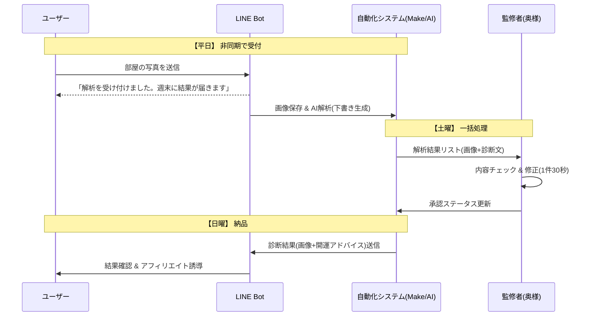

ご指定の事業計画（フィジビリティ重視版）をMarkdown形式にまとめました。
コピーして、Notion、Obsidian、GitHubのREADME等に貼り付けてそのままプロジェクト管理用ドキュメントとしてご使用ください。

---

```markdown
# 新規事業計画書：週末稼働型AI部屋診断サービス「AURA-MAP」

**作成日:** 2025/12/26
**フェーズ:** 企画・PoC（概念実証）
**ターゲット:** 土日稼働の副業レベルでのMVPリリース

---

## 1. 事業コンセプト
**「インテリアコーディネート」を「運気診断（部屋占い）」として再定義する。**
高尚なデザイン提案ではなく、「運気を下げている要因（澱み）」を可視化・除去することで、コンプレックス解消と開運を同時に提供する。

### 現状の課題と解決策
* **課題:** 従来の人力インテリア相談は「敷居が高い」「恥ずかしい」「労働集約型で低時給」。
* **解決:**
    * **入り口:** 「運気」という切り口でハードルを下げる。
    * **技術:** AI画像認識で診断を自動化。
    * **運用:** 平日は自動集客・蓄積、土日に一括処理する「非同期型」でサラリーマンの副業に最適化。

---

## 2. システム構成（MVPモデル）
開発工数を最小化するため、Webサイト構築は行わず、既存プラットフォームとNoCodeツールを活用する。

### Tech Stack
| カテゴリ | 採用ツール/技術 | 役割 |
| :--- | :--- | :--- |
| **Frontend** | **LINE公式アカウント** | ユーザーインターフェース（画像送信、結果通知）。 |
| **Backend** | **Make (旧Integromat) or n8n** | 処理の自動化ハブ。コードを書かずにワークフローを構築。 |
| **AI Brain** | **OpenAI API (GPT-4o)**<br>or **Gemini 1.5 Pro** | 画像解析、座標特定、診断テキスト生成。 |
| **Image Proc** | **Cloud Functions**<br>(Python or Rust) | 座標データに基づき、画像に「澱（黒いモヤ）」や「赤丸」を合成。 |
| **Storage** | **Google Drive** | ユーザー画像の保存、生成物の格納。 |

---

## 3. オペレーションフロー（週間スケジュール）
**「平日は溜める、週末に捌く」**スタイルで、本業への干渉を防ぐ。

### 業務サイクル
1.  **平日（完全自動）**
    * ユーザーがLINEに画像を送信。
    * Botが受付メッセージ送信＆画像をDriveへ保存。
    * AIが予備解析（JSONデータの生成）まで完了させておく。
2.  **土曜日（バッチ処理・監修）**
    * **開発者（私）:** 画像加工バッチを実行（または自動実行結果の確認）。
    * **監修者（奥様）:** 管理シート（Spreadsheet/Notion）で「AI診断文」と「加工画像」を確認。
        * OKなら「承認」、NGならその場で修正。所要時間は1件1分以内。
3.  **日曜日（納品・改善）**
    * 承認済みデータをLINEで一斉配信。
    * 次週に向けたプロンプトの微調整（奥様のフィードバックをAIに反映）。



---

## 4. 収益モデル（階段型）

| 段階 | 商品・サービス | 価格帯 | 狙い |
| --- | --- | --- | --- |
| **集客** | 簡易診断（「澱」の可視化画像） | 無料 / 低価格 | 「自分の部屋がヤバい」という不安と興味の喚起。SNS拡散用。 |
| **収益** | 浄化レポート（具体的改善案） | ¥500〜¥1,000 | 「どこをどう片付ければいいか」の具体的指示。 |
| **拡大** | 開運インテリア提案 | 紹介料 (数%) | 「この鏡を置くと運気UP」等のAmazon/楽天アフィリエイト。 |

---

## 5. ロードマップ

### Phase 1: PoC（ココナラ手動対応）

* **期間:** 1ヶ月目
* **目的:** ニーズ検証と「奥様の負担感」の確認。
* **アクション:**
* ココナラ等でスキル出品。
* 手動でChatGPTに画像を投げ、結果を編集して返す。
* システム開発はまだ行わない。


### Phase 2: LINE Bot β版（半自動化）

* **期間:** 2〜3ヶ月目
* **目的:** 処理能力の向上とリスト取り。
* **アクション:**
* Make/n8nでLINEとOpenAIを連携。
* 画像への「澱」合成スクリプト（Python/Rust）の実装。


### Phase 3: マネタイズ強化（アフィリエイト連携）

* **期間:** 4ヶ月目〜
* **目的:** 客単価アップ。
* **アクション:**
* 診断結果に応じた商品リンク自動挿入ロジックの実装。


---

## 6. すぐにやるべきこと（Next Action）

システムを作る前に、**「AIが奥様の納得する診断を出せるか」**を検証する。

1. 自宅の「散らかった場所」や「暗い場所」の写真を撮る。
2. ChatGPT (GPT-4o) に以下のプロンプトを投げる。

### 検証用プロンプト案

```text
あなたは風水師です。添付した部屋の画像を見て、以下のタスクを実行してください。

1. 【可視化データ】: 運気を下げている「散らかった場所」「暗い場所」「配置が悪い場所」の画像上の座標範囲（または位置の記述）を特定してください。
2. 【診断】: その場所がどのような運気（金運、健康運、恋愛運など）を下げているか、ロジックを含めて解説してください。
3. 【コメント】: ユーザーが少し「ドキッ」とするような、辛口かつ不安を煽る短い警告文を作成してください。

出力はJSON形式でお願いします。

```

3. 出力結果を奥様に見せ、「これならあり」か「全然違う」か判断をもらう。

```

```