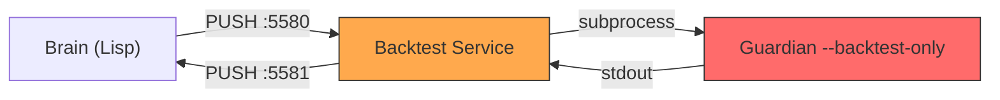

# 🚨 Swimmy Evolution Pipeline 診断レポート

**診断日時**: 2026-02-04 22:20 JST  
**システムバージョン**: V50.5

---

## 🔴 Critical Issues Summary

| Issue | Impact | Root Cause |
|:--|:--|:--|
| **198,672件の戦略がSharpe=0/NULL** | 進化が機能していない | バックテスト結果がDBに反映されていない |
| **S-Rank / A-Rank = 0** | 昇格パイプライン完全停止 | バックテスト結果が戻ってきていない |
| **Gen1000+世代だが改善なし** | 遺伝的進化が無意味化 | 適応度（Sharpe）情報がない状態で交配 |
| **OOS検証: 0 sent / 0 success** | A-Rank昇格不可 | バックテストキューが詰まっている |

---

## 🔍 Root Cause Analysis

### Problem 1: バックテスト結果フローの断絶



**発見事項**:
1. **Brain → Backtest Service (5580)**: 正常に送信中（大量のリクエスト送信ログあり）
2. **Backtest Service → Guardian**: 処理中（CPU 107%で稼働中）
3. **Guardian → Backtest Service**: **ボトルネック** — 700万行CSVのバックテストに時間がかかりすぎ
4. **Backtest Service → Brain (5581)**: 結果が来ないため送信できない

**決定的証拠**:
```
=== Strategy Rank Summary ===
:B: 7
:GRAVEYARD: 198781
:LEGEND: 65
NIL: 1

=== BACKTEST RESULT STATUS ===
Strategies with valid Sharpe: 14      ← たった14件！
Strategies with NULL/0 Sharpe: 198672 ← 約20万件が未処理
```

### Problem 2: バックテストキューの飽和

**現状のフロー速度**:
- **生成速度**: 1時間あたり数十〜数百の新戦略が生成される
- **バックテスト処理速度**: 1件あたり推定10-30秒（700万行CSVの場合）
- **キュー蓄積**: リクエストが処理を大幅に上回り、キューが無限に成長

**ログ証拠**:
```
[HEADHUNTER] 🚀 Requesting deferred BT for Bred-Bred--695-Gen1109...
[HEADHUNTER] 🚀 Requesting deferred BT for Bred-Bred--695-Gen1098...
[HEADHUNTER] 🚀 Requesting deferred BT for Bred-Bred--695-Gen1081...
... (1000+世代分のリクエストが一気に送信)
```

### Problem 3: 進化ロジックの無効化

**問題**: Sharpeが0/NULLの戦略同士を交配しても、
- 選択圧がかからない（全員が同じ適応度）
- エリート抽出が機能しない
- 世代が進んでも改善されない

```
=== Top 15 Strategies by Sharpe ===
:LEGEND      |  4.036 | Legend-Golden-Cross-Classic  ← 外部導入
:GRAVEYARD   |  3.519 | Hunted-W1-EMA-Trend          ← Graveyard送り
:B           |  2.727 | Hunted-W1-Volume-Trend       ← 外部導入
```

**Bred-* 系戦略のSharpeはすべて0/NULL** — 進化で生成された戦略は一切評価されていない！

---

## 🛠️ Recommended Fixes (Codex向け)

### Fix 1: バックテスト処理の高速化（最重要）

**A. データ量の削減**
```bash
# 現状: 7,334,746行 (約20年分のM1データ)
# 推奨: 直近2-3年分に削減 (約100万行)
head -n 1000000 data/historical/USDJPY_M1.csv > data/historical/USDJPY_M1_recent.csv
```

**B. バッチサイズの調整**
```lisp
;; 現状: 10000本要求している
(Candles: 10000 / TF: M3600)

;; 推奨: 2000-3000本に削減
(defparameter *backtest-candle-count* 3000)
```

**C. 並列バックテスト処理**
```
;; Backtest Service を複数ワーカーにスケールアウト
;; guardian --backtest-only を複数プロセス起動
```

### Fix 2: キュー管理の改善

**A. Rate Limiting の導入**
```lisp
;; 1秒あたりのバックテスト要求を制限
(defparameter *backtest-rate-limit* 5) ;; 5件/秒
```

**B. Pending Queue の監視**
```lisp
;; キューが一定サイズを超えたら新規リクエストを抑制
(when (> (length *pending-backtest-queue*) 100)
  (warn "Backtest queue overflow, throttling..."))
```

### Fix 3: 結果フローの修復

**A. apply-backtest-result のロギング追加**
```lisp
(defun apply-backtest-result (name metrics)
  (format t "[APPLY-BT] Applying result: ~a Sharpe=~a~%" 
          name (getf metrics :sharpe))
  ;; 既存のロジック
  ...)
```

**B. 5581 PULLソケットの受信確認**
```lisp
;; Brain側で5581からの受信をログ
(format t "[5581-RECV] Got backtest result: ~a~%" msg)
```

### Fix 4: Lifecycle Flow のデバッグ

**サイクル完了→結果なし の原因調査**:
1. `school-narrative-report` はfile writeしているがDiscord通知が来ていない？
2. Evolution Daemon の結果集計ロジック確認
3. `*rr-backtest-results-buffer*` の内容確認

---

## 📊 Immediate Actions

1. **Backtest Serviceの再起動** — キューをクリアして仕切り直し
2. **CSVデータの軽量化** — 直近2年分に制限
3. **デバッグログの有効化**:
   ```bash
   export SWIMMY_BACKTEST_DEBUG_RECV=1
   export SWIMMY_BACKTEST_DUMP_GUARDIAN=1
   ```
4. **処理速度の計測** — 1件のバックテストに何秒かかっているかを記録

---

## 🎯 Success Criteria

| Metric | Current | Target |
|:--|:--|:--|
| Strategies with valid Sharpe | 14 | > 1000 |
| Backtest throughput | ~0 results/hour | > 100 results/hour |
| S-Rank count | 0 | ≥ 1 |
| A-Rank count | 0 | ≥ 5 |
| OOS success rate | 0% | > 50% |

---

## 🔥 Priority Order for Codex

1. **[P0]** バックテスト結果が Brain に届いていない問題の修正
2. **[P1]** バックテスト処理速度の改善（データ量削減 or 並列化）
3. **[P2]** キュー管理とRate Limiting の導入
4. **[P3]** Lifecycle Flow のデバッグとDiscord通知の修正
