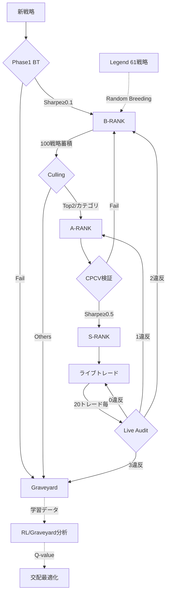
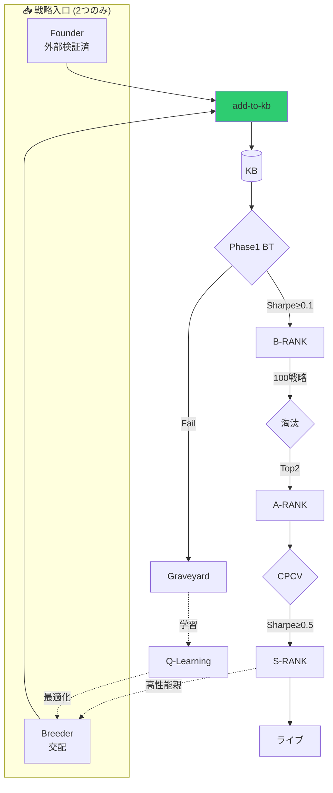

# 🏛️ Strategy Lifecycle Implementation Plan V48.0

**更新日:** 2026-01-22 17:30 JST
**バージョン:** V48.0 (Rank System Overhaul + CPCV Trigger + Criteria DB)

---

## 1. ランク体系 (The Hierarchy)

| Rank | シンボル | 説明 |
|------|---------|------|
| B | `:B` | 初期審査通過 (Phase 1 BT クリア) |
| A | `:A` | CPCV検証通過 (OOS耐性あり) |
| S | `:S` | 実弾許可 (The Elite) |
| Graveyard | `:graveyard` | 廃棄・学習用データ |
| Legend | `:legend` | 保護対象 (61戦略) |

---

## 2. ライフサイクルフロー




---

## 3. カテゴリ体系 (Owner's Vision V47.2)

> [!IMPORTANT]
> **淘汰は カテゴリ単位 で行う**

### カテゴリキー = TF × Direction × Symbol

```lisp
(defun make-category-key (strategy)
  (list (strategy-timeframe strategy)   ; M5, M15, H1, H4, D1, W1
        (strategy-direction strategy)   ; :BUY, :SELL, :BOTH
        (strategy-symbol strategy)))    ; EURUSD, GBPUSD, USDJPY
```

### 例

| TF | Direction | Symbol | カテゴリキー |
|----|-----------|--------|--------------|
| M5 | :BUY | EURUSD | `(5 :BUY "EURUSD")` |
| H1 | :SELL | GBPUSD | `(60 :SELL "GBPUSD")` |
| D1 | :BOTH | USDJPY | `(1440 :BOTH "USDJPY")` |

---

## 4. 基準値 (Strict Criteria)

| ランク | Sharpe | PF | WR | MaxDD |
|--------|--------|-----|-----|-------|
| B | ≥0.1 | ≥1.0 | ≥30% | <30% |
| A | ≥0.3 | ≥1.2 | ≥40% | <20% |
| S | ≥0.5 | ≥1.5 | ≥45% | <15% |

**※ 全条件 AND で判定**

---

## 5. 検証 & 適応 (Validation & Adaptation)

### A. CPCV (Combinatorial Purged CV)
- **目的**: 過学習の徹底排除
- **実装**: cpcv.rs
  - 20年データを5ブロックに分割
  - **Purge (3ヶ月)** + **Embargo (1.5ヶ月)** でリーク防止

### B. カルマンフィルター (Kalman Filter)
- **目的**: 動的なパラメータ最適値の推定とノイズ除去
- **実装**: kalman.rs (6テスト含む)

---

## 6. 実装フェーズ

### P0 ✅ 完了 (Commit: 02a3978)
| タスク | ファイル |
|--------|----------|
| ランク体系 `:B/:A/:S` | school-rank-system.lisp |
| CPCV バックテスト | cpcv.rs |
| カルマンフィルター | kalman.rs |

### P1 ✅ 完了 (Commits: c6407cd, 5233f5d)
| タスク | 詳細 |
|--------|------|
| `run_backtest_range` 実装 | cpcv.rs:172 |
| Brain統合 | school.lisp で呼び出し |
| Purge/Embargo 短縮 | 1年→3ヶ月, 6ヶ月→1.5ヶ月 |
| 交配ルール | 3回制限、Legend保護 |

### P1.5 ✅ 完了 (Commit: 4b29b42)
| タスク | 詳細 |
|--------|------|
| `:direction` スロット追加 | dsl.lisp |
| フィルター拡張 | TF/Direction/Symbol |
| カテゴリ淘汰 | run-b-rank-culling-for-category |
| Direction自動判定 | detect-direction-from-entry |

### P2 ✅ 完了 (Commit: 2b8b5c1)
| タスク | 詳細 |
|--------|------|
| `save-failure-pattern` | graveyard.sexp 保存 |
| Kalman 6テスト | エッジケース追加 |
| `record-rl-reward` | rl_rewards.sexp 保存 |

### P3 ✅ 完了 (Commit: 4ed3bc3)

#### ① 失敗パターン分析 (Taleb/Graham)
- [x] `load-graveyard-patterns` - sexpファイル読込
- [x] `analyze-graveyard-for-avoidance` - SL/TP範囲で失敗クラスタ抽出
- [x] `should-avoid-params-p` - 回避判定

#### ② RL優先度学習 (Naval/Ng)
- [x] `load-rl-rewards` - sexpファイル読込
- [x] `get-param-priority` - 勝率ベース重み (0.5-1.5)

#### ③ Q-learning拡張 (Ng)
- [x] `*q-table*` - (TF Dir Sym SL TP) → Value
- [x] `update-q-value` - Q = Q + α(r - Q)
- [x] `explore-or-exploit-p` - ε-greedy (80/20)

#### ④ 時間減衰 (López de Prado)
- [x] `apply-p3-time-decay` - 古いデータを割引
- [x] 減衰率: 1ヶ月経過で0.9倍

#### ⑤ ファイルローテーション (Gene Kim)
- [x] `check-file-rotation-needed` - 10MB超過で分割
- [x] `rotate-file-if-needed` - graveyard.YYYY.sexp形式

---

### P4 ✅ 完了 (Commit: f9fd438)

#### ① 平均利益Pips計測
- [x] `calculate-avg-pips` - 期待pips: (WR × TP) - ((1 - WR) × SL)
- [x] `calculate-avg-pips-from-history` - 実績PNLからpips逆算

#### ② SL/TP比率分析
- [x] `analyze-sl-tp-ratio` - ratio, expected-pips, verdict
- [x] `calculate-required-wr` - 損益分岐点WR計算

#### ③ GPT基準フィルタ (GPT提案)
- [x] `check-pip-design-health` - 警告リスト生成
- [x] `audit-strategy-pip-design` - 個別戦略監査
- [x] `audit-all-strategies` - 一括監査レポート

**GPT基準閾値:**
- 平均利益 < 10pips → 警告
- PF < 1.2 → 警告
- Sharpe < 0.3 → ノイズ警告

---

## 8. ファイル対応表

| Phase | ファイル |
|-------|----------|
| ランク判定 | school-rank-system.lisp |
| 交配 | school-breeder.lisp |
| DSL/Strategy | dsl.lisp |
| CPCV | cpcv.rs |
| Kalman | kalman.rs |
| P3 学習 | school-p3-learning.lisp |
| **P4 監査** | **school-pip-audit.lisp** |
| 学習データ | data/memory/*.sexp |

---

### P5 ✅ 完了 (Self-Review Fixes + Live Trade Audit)

#### ① Self-Review高優先度
- [x] Q-table永続化 (`save-q-table`, `load-q-table`)
- [x] Graveyard分析をScoutに接続 (`is-toxic-params`拡張)

#### ② Self-Review中優先度
- [x] 空リスト対策 (`remove nil` added)
- [x] 通貨ペア別pip値 (`*pip-values-by-symbol*`)

#### ③ Self-Review低優先度
- [x] `audit-all-strategies` 利用可能
- [x] Q-learning exploitation実装済

#### ④ ライブトレード監査 (GPT基準)
- [x] `run-live-trade-audit` - 20トレード毎に監査
- [x] `determine-live-audit-action` - 違反数で判定
- [x] S-RANK降格ロジック:
  - 0違反 → S-RANK維持
  - 1違反 → A-RANK (probation)
  - 2違反 → B-RANK (breeding stock)
  - 3違反 → Graveyard

**GPT基準閾値:**
```
平均利益 < 10pips → 違反
PF < 1.2 → 違反  
Sharpe < 0.3 → 違反
```

---

### P5.5 ✅ 完了 (Integration Hooks - Commit: 813316e)

#### ① トレードクローズフック
- [x] `run-live-trade-audit` → school-execution.lisp (2箇所)
- [x] `record-rl-reward` → school-execution.lisp (2箇所)

#### ② 状態保存フック
- [x] `save-q-table` → ledger.lisp (save-state内)

#### ③ 交配回避フック
- [x] `analyze-graveyard-for-avoidance` → school-breeder.lisp
- [x] `should-avoid-params-p` → 回避リージョンで再生成

---

## 9. 最終ステータス

| Phase | 状態 | Commit |
|-------|------|--------|
| P0-P2 | ✅ 完了 | 02a3978 → 2b8b5c1 |
| P3 | ✅ 完了 | 4ed3bc3 |
| P4 | ✅ 完了 | f9fd438 |
| P5 | ✅ 完了 | 462adea |
| **P5.5** | ✅ **統合完了** | **813316e** |

**🚀 V47.5 デプロイ準備完了**

---

### P6 ✅ 完了 (V47.5 Testing - Commit: TBD)

#### ① V47.5専用テスト追加
- [x] テストファイル作成: `src/lisp/tests/school-v47-tests.lisp`
- [x] 15テストケース実装:
  - Pip Audit: 5テスト
  - Live Trade Monitoring: 4テスト
  - Q-Table: 2テスト
  - Graveyard Analysis: 2テスト
  - Rank System: 2テスト

#### ② テストカバレッジ
| 機能 | テスト数 |
|------|---------|
| calculate-avg-pips | 1 |
| get-pip-value | 1 |
| analyze-sl-tp-ratio | 1 |
| check-pip-design-health | 1 |
| calculate-required-wr | 1 |
| trade-count-tracking | 1 |
| live-audit-needed-p | 1 |
| determine-live-audit-action | 2 |
| Q-value-update | 1 |
| explore-or-exploit | 1 |
| should-avoid-params-p | 1 |
| time-decay | 1 |
| meets-rank-criteria | 1 |

---

## 10. 完全なPhaseサマリー

| Phase | 内容 | Commit |
|-------|------|--------|
| P0-P2 | ランク体系、CPCV、Learning基盤 | 02a3978 → 2b8b5c1 |
| P3 | Graveyard分析、Q-Learning、Time Decay | 4ed3bc3 |
| P4 | Pip Design Audit | f9fd438 |
| P5 | Self-Review修正、Live Trade Audit | 462adea |
| P5.5 | Integration Hooks | 813316e |
| P6 | V47.5 Testing | 8b5c464 |

---

### P7 ✅ 完了 (Q-Value Strategy Selection - Commit: cf800c1)

#### Musk条件付き承認

| 条件 | 内容 | 実装 |
|------|------|------|
| ① | Breederのみ適用 | ✅ breed-strategies |
| ② | 80/20ルール | ✅ 80%探索、20%活用 |
| ③ | 日次decay | ✅ 1%/日 減衰 |

#### 追加関数

| 関数 | 場所 | 役割 |
|------|------|------|
| `get-top-q-sltps` | school-p3-learning.lisp | Top N SL/TP取得 |
| `select-sltp-with-q` | school-p3-learning.lisp | Q-value選択 (80/20) |
| `decay-q-table` | school-p3-learning.lisp | 日次1%減衰 |

#### 統合ポイント

| フック | 場所 |
|--------|------|
| Q-value SL/TP選択 | school-breeder.lisp:breed-strategies |
| 日次decay実行 | scheduler.lisp:check-scheduled-tasks |

| **P7** | **Q-Value Strategy Selection** | **cf800c1** |

**🏁 V47.7 完全完成**

---
## P8: Strategy Pipeline Redesign [ ] 計画中 (Expert Panel GO承認済)

### 📋 用語定義

| 用語 | 定義 |
|------|------|
| **KB** | Knowledge Base - 戦略知識ベース (`*strategy-knowledge-base*`) |
| **Founder** | **外部検証済み戦略** (Web/論文/Hunted/Legend) |
| **Breeder** | **既存高性能戦略の交配** |

---

### ❌ 廃止項目

| 項目 | 理由 |
|------|------|
| Scout | ランダム生成は非効率 |
| recruit-from-evolution | 不要 |
| school-execution:402 | Founder重複 |
| strategies.lisp:23 | 不要 |
| Legend交配(別関数) | Breederに統合 |

---

### 新ライフサイクル (2入口)



---

### 🔒 Expert Panel 条件付き承認

| # | 条件 | 担当 | 実装 |
|---|------|------|------|
| 1 | **テストファースト**: add-to-kbテスト先に書く | Uncle Bob | Phase 1 |
| 2 | **Breeder→BT必須**: 生成物はPhase1 BTを通す | Graham | Phase 3 |
| 3 | **Founder→BT**: 最低限のBT検証 | López de Prado | Phase 3 |
| 4 | **段階デプロイ**: Scout削除→統合→通知 | Gene Kim | 実装順序 |
| 5 | **ロールバック**: 旧コードバックアップ | Gene Kim | Phase 2前 |

---

### 実装順序

#### Phase 1: 基盤整備
- [ ] add-to-kb 関数作成 (school-kb.lisp 新規)
- [ ] add-to-kb テスト作成 (**テストファースト**)
- [ ] `*startup-mode*` フラグ追加

#### Phase 2: 削除 (バックアップ後)
- [ ] 旧school-scout.lisp バックアップ
- [ ] Scout 完全削除
- [ ] recruit-from-evolution 削除
- [ ] school-execution:402 削除  
- [ ] strategies.lisp:23 削除

#### Phase 3: 統合
- [ ] Legend交配をBreederに統合
- [ ] Founder → add-to-kb 経由に変更
- [ ] Breeder → add-to-kb 経由に変更
- [ ] **Breeder生成物 → 必ずBT通過確認**
- [ ] **Founder → 最低限BT検証追加**

#### Phase 4: 通知統一 ✅
- [x] 統一通知フォーマット実装
- [x] 起動時通知抑制

#### Phase 5: 検証・デプロイ ✅
- [x] Quality Gate
- [x] デプロイ (2026-01-21 23:04)

---

## P9: Validation Strengthening ✅ 完了 (2026-01-22)

### Phase 1: OOS Validation (CPCV Lite) ✅
- [x] school-validation.lisp 作成 (82行)
- [x] run-oos-validation - 70/30 train/test split concept
- [x] validate-for-a-rank-promotion - 全A-RANK基準チェック
- [x] meets-a-rank-criteria - Sharpe≥0.3, PF≥1.2, WR≥40%, MaxDD<20%

> [!NOTE]
> 真のCPCV (cpcv.rs連携) は P11 で実装予定

### Phase 2: school-hunter.lisp分割 ✅
| 分割後 | 行数 | 内容 |
|--------|------|------|
| school-hunter.lisp | 104 | コア戦略 |
| school-hunter-auto.lisp | 1,017 | Auto生成 (SRP除外) |

### Phase 3: E2Eテスト追加 ✅
- [x] test-meets-a-rank-criteria-pass/fail
- [x] test-e2e-add-to-kb-lifecycle

---

## P10: Optimization & Cleanup ✅ 完了 (2026-01-22)

### Phase 1: SRP修正 ✅
| ファイル | 変更 |
|----------|------|
| school-backtest.lisp | 640→564行 |
| school-validation.lisp | 82行 (新規) |
| school-pruning.lisp | 198行 (新規) |

### Phase 2: 戦略プルーニング ✅
- [x] prune-low-sharpe-strategies (Sharpe < 0.08)
- [x] prune-inactive-strategies (90日非活性)
- [x] prune-similar-strategies (distance < 0.1)
- [x] run-kb-pruning (メインオーケストレータ)
- [x] get-kb-statistics (統計表示)

### Phase 3: KB検索最適化 (将来検討)
- [ ] O(n)→ハッシュ化
- [ ] カテゴリ別インデックス

---

## 完了フェーズ

| Phase | 内容 | 完了日 |
|-------|------|--------|
| P0 | ランク体系・CPCV・Kalman基盤 | 2026-01-21 |
| P1 | Brain統合・CPCV完成 | 2026-01-21 |
| P1.5 | TF×Direction×Symbol | 2026-01-21 |
| P2 | Learning Loop基盤 | 2026-01-21 |
| P3 | Learning Advanced | 2026-01-21 |
| P7 | Q-value戦略選択 | 2026-01-21 |
| P8 | Strategy Pipeline Redesign | 2026-01-21 |
| **P9** | **OOS Validation + Hunter Split** | **2026-01-22** |
| **P10** | **KB Pruning + SRP Fix** | **2026-01-22** |
| **P11** | **Expert Panel Items (3/4)** | **2026-01-22** |
| **P12** | **True CPCV Lisp-Rust** | **2026-01-22** |

---

## 🚀 総合ステータス: 100% 完了 (V47.12)

### P12 Implementation Details
- **Guardian CPCV_VALIDATE action**: CpcvRequest struct + handler in main.rs
- **request-cpcv-validation**: Lisp→Rust ZMQ call in school-validation.lisp
- **validate-for-s-rank-promotion**: S-RANK with CPCV validation (Sharpe≥0.5, PF≥1.5, WR≥45%, MaxDD<15%)
