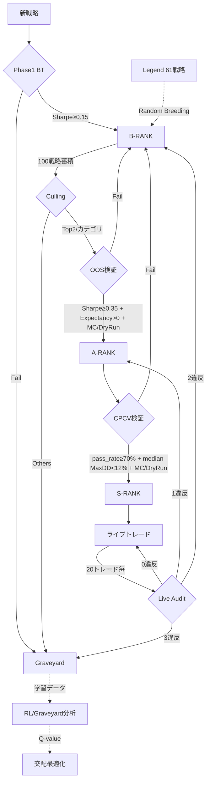
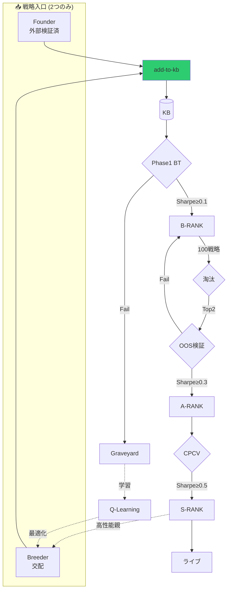

# 🏛️ Strategy Lifecycle Implementation Plan V50.6

**更新日:** 2026-02-19 JST
**バージョン:** V50.6 (Structured Telemetry & Retired Rank)

---

## 2026-02-19 実装追補: TF正本化の徹底（意味カテゴリは補助タグ）

- 方針:
  - `strategy-category` は新形式 `TF DIRECTION SYMBOL` を正本として扱う。
  - 旧来の意味カテゴリ（`trend/reversion/scalp/breakout`）は主キーとしては使わず、`strategy-regime-class` で補助的に推定・参照する。
- 実装:
  - `*regime-pools*` を導入し、意味カテゴリ系の集計・レジーム選抜・生態系評価はこのプールを参照。
  - `*category-pools*` は TFスコープ（`TF DIRECTION SYMBOL`）用途として維持。
  - KB追加/除去・実行系・ランク遷移時に `*category-pools*` と `*regime-pools*` を同時同期。
  - `cull-pool-overflow` は regime pool 優先で処理し、victim の scope pool 側も明示的に除去。
  - 旧「意味カテゴリへ移行（migrate）」前提の処理は除去し、新方式に一本化。

### 追加/更新テスト（2026-02-19 実行）

- `test-strategy-regime-class-prefers-semantic-and-infers-scope-keys` → pass
- `test-select-strategies-for-regime-supports-tf-direction-category-keys` → pass
- `test-select-strategies-for-regime-uses-real-categories` → pass
- `test-breeder-cull-uses-composite-score` → pass（`*regime-pools*` 前提へテスト更新）

### 検証（2026-02-19 JST）

- ターゲット回帰:
  - `sbcl --non-interactive --eval ... (swimmy.tests::test-...)` 群 → **all pass**
- フル回帰:
  - `SWIMMY_DISABLE_DISCORD=1 sbcl --script tests/test_runner.lisp` → **462 passed / 0 failed**

---

## 2026-02-18 運用追補: systemdスコープ整合 + Backtest Heartbeat可観測性

- 背景:
  - `systemctl --user status swimmy-*` は `unit not found` だが、実プロセス/ポートは稼働しているように見える状態が継続。
  - `logs/backtest.log` の更新停滞により、Backtest停止と誤認しやすい観測ギャップが発生。
- 原因:
  - Swimmyコア（`swimmy-brain/school/backtest/guardian/data-keeper/notifier/risk`）は user scope ではなく system scope で稼働。
  - PID `cgroup` は `/system.slice/swimmy-*.service` を指しており、`journalctl -u`（system）が正本、`journalctl --user` は空でも異常とは限らない。

### 対応

- 診断手順を更新:
  - `pipeline-diagnosis` スキルを更新し、確認順を `systemctl status`（system）優先へ変更。
  - `journalctl -u`（system）→ `journalctl --user -u`（user）の順で確認する手順へ変更。
  - `/proc/<pid>/cgroup` による system/user scope 判定を手順に追加。
  - 反映先:
    - `/home/swimmy/swimmy/.codex/skills/pipeline-diagnosis/SKILL.md`
    - `/home/swimmy/.codex/skills/pipeline-diagnosis/SKILL.md`
- Backtest可観測性を改善:
  - `tools/backtest_service.py` に heartbeat を実装（既定60秒、`SWIMMY_BACKTEST_HEARTBEAT_SEC=0` で無効化）。
  - 出力内容: `inflight/recv/submit/done/sent/rx_age/tx_age`。
  - テスト追加: `tools/test_backtest_service.py`。

### 検証（2026-02-18 JST）

- テスト:
  - `python3 tools/test_backtest_service.py` → `ok`
  - `PYTHONPATH=/home/swimmy/swimmy python3 tools/tests/test_systemd_drift_probe.py` → `OK`
- サービス:
  - `sudo -n systemctl restart swimmy-backtest` 実行後、`swimmy-backtest.service` は `active (running)`。
  - `logs/backtest.log` に heartbeat 行を確認:
    - 例: `[BACKTEST-SVC] ❤️ HEARTBEAT inflight=0/6 recv=... tx_age=...`
- パイプライン:
  - `oos_queue` は空（`[]`）を確認。

### 取り込み状況（2026-02-18 JST）

- master へ反映済み・push済み（`origin/master`）。
- worktree先行コミット（`d083399`, `c559885`, `85d5297`）は `cherry-pick` 検証で空コミット化（同等内容が master 済み）を確認。
  - `git cherry -v master feat-polyclaw-safety-weather` → `- d083399 ...`
  - `git cherry -v master feat-weather-open-meteo` → `- c559885 ...`, `- 85d5297 ...`

## 2026-02-17 運用追補: Live実行TFコンテキストの fail-close 強化

- `prepare-trade-context` は、呼び出し側から渡る `strategy-timeframe` よりも、解決済み戦略オブジェクトの `strategy-timeframe` を優先するよう修正。
- `execute-category-trade` は、`timeframe` が有効でも `strategy-name` が KB/evolved で解決できない場合に fail-close（`execution.context_missing`）するよう修正。
- これにより、古いシグナルペイロード由来の `|M1` 混入や `unknown` 戦略名での発注を抑止。

### 追加テスト（2026-02-17 実行）

- `test-prepare-trade-context-prefers-strategy-timeframe-over-stale-override` → pass
- `test-execute-category-trade-fails-closed-on-unresolved-strategy-name` → pass
- `test-execute-category-trade-fails-closed-on-missing-timeframe` → pass（回帰なし）

### 運用確認（2026-02-17 JST）

- `swimmy-school.service` を再起動し、`ExecStartPre`（`tools/restore_legend_61.lisp`）成功を確認。
- DB確認: `Aggressive-Reversal=10080(W1)`, `MA-Ribbon-Scalp=10080(W1)`, `CCI-Trend-Breakout=240(H4)`。
- 再起動後ログで対象3戦略の `execution.order_submitted` に `M1` は未検出。
- `src/mt5/SwimmyBridge.mq5` の再コンパイル成功（2026-02-17 JST、ローカル確認）。
- `swimmy-guardian.service` を 2026-02-17 20:02 JST に再起動し、`0.0.0.0:5557/5560` の再リッスン復帰と `Active: running` を確認。
- 再起動後監査: `python3 tools/check_order_timeframe_consistency.py --lookback-minutes 30 --fail-on-issues` → `orders=3 issues=0`。
- 監査ツール `tools/check_order_timeframe_consistency.py` を追加。  
  例: `python3 tools/check_order_timeframe_consistency.py --since 2026-02-17T17:04:06 --fail-on-issues`
- `tools/system_audit.sh` に「Order timeframe consistency」ステップを統合。既定は `--lookback-minutes 120`（`ORDER_TF_AUDIT_LOOKBACK_MINUTES` で変更、固定開始時刻は `ORDER_TF_AUDIT_SINCE`）。
- `src/mt5/SwimmyBridge.mq5` を運用補強:
  - S式キー抽出は「パターン定義順」ではなく「文字列内で最初に現れた一致」を優先（混在フォーマット時の誤抽出を低減）
  - S式キー抽出は quoted string 内の疑似キー一致を探索対象外にし、判定は事前マスク化で低オーバーヘッド化
  - `ORDER_OPEN` は `instrument` 欠落時でも `symbol` を受理（旧ペイロード互換）
  - `instrument/symbol` が `NIL/NULL/NONE` の場合は空扱いに正規化し、`ORDER_OPEN` は fail-close
  - `ORDER_OPEN` の `symbol=ALL` は fail-close（全チャート一括発注を禁止）
  - `HISTORY` 送信の `total` バッチ数を厳密計算（5000本境界の off-by-one 解消）
  - コマンド処理は `MAX_COMMANDS_PER_TIMER` で1秒あたり複数件ドレイン
  - ZMQ `context/socket` 生成失敗時は `INIT_FAILED` / 接続失敗扱いで fail-close、`ACK/REJECT` 送信全失敗時は `g_pub_connected=false` に落として再接続ループへ復帰

## 2026-02-17 実装追補: TF内部統一 + 低トレード過大評価補正

- TF内部表現を `minutes(int)` 正本で統一（`M36/H2/H5/H60` 等の任意TFを許容）。
- 8TF (`M5/M15/M30/H1/H4/D1/W1/MN`) は「デフォルト集合」として維持しつつ、カテゴリ淘汰/相関スコープはバケット化で有限化。
- Pattern Gate は任意TFを直接拒否せず、クエリ時にバケットTFへ正規化（例: `H5 -> H4`）。
- Guardian 側TF解釈を統一し、`M/H/D/W/MN` と数値分文字列（例: `"300"`）を同一経路で秒換算。
- `runner/main` の履歴要求TFを定数由来に統一（ハードコード分岐を削減）。

### 低トレード補正（トレード数35問題への対処）

- `score-from-metrics` に trade evidence 係数を導入し、低サンプル時のSharpe寄与を縮小。
- A評価 / Breeder優先度 / Cullingスコアに `:trades` を渡し、同じ補正式で評価。
- 通知側は raw Sharpe に加えて adjusted Sharpe を併記し、低頻度戦略の過信を抑制。
- Evolution Report `Top Candidates` も raw Sharpe順から `evidence-adjusted-sharpe` 順へ統一し、表示を `S=<adjusted> (raw <raw>)` に更新。
- A/S ランクに trade evidence floor を導入（A>=50, S>=100）。`run-rank-evaluation` で既存ランクにも降格スイープを適用。
- `evaluate-a-rank-strategy` は floor 未達を即時 `:B` 降格として扱い、A維持を許容しない。

### 検証（2026-02-17 実行）

- `sbcl --script tests/test_runner.lisp` → **419 passed / 0 failed**
- `cd guardian && cargo test test_get_tf_duration_supports_custom_timeframes -- --nocapture` → **pass**

### 実測スナップショット（2026-02-17）

- 対象DB: `data/memory/swimmy.db`
- rank件数: `:A=36`, `:S=2`, `:B=140`, `:INCUBATOR=4972`, `:GRAVEYARD=350158`, `:RETIRED=39841`, `:LEGEND=26`
- floor違反件数: `A_lt50=0`, `S_lt100=0`（違反ゼロを確認）
- 低トレード高Sharpe上位10件は現在 `:GRAVEYARD`（A/Sではない）であることを確認
- backup table: `trade_floor_backup_20260217` が存在し、`1707` rows

### 追加ターゲットテスト（2026-02-17 実行）

- `test-timeframe-utils-support-arbitrary-minutes` → pass
- `test-timeframe-bucketization-is-finite` → pass
- `test-score-from-metrics-penalizes-low-trade-evidence` → pass
- `test-evaluate-a-rank-demotes-on-min-trade-evidence` → pass
- `test-enforce-rank-trade-evidence-floors-demotes-existing-as` → pass
- `cd guardian && cargo test test_sharpe_ratio_includes_zero_returns -- --nocapture` → pass

### テスト追補（2026-02-17 追加）

- 失敗していた回帰テストを、現行仕様（A: TradeEvidence>=50 / S: TradeEvidence>=100、S昇格時CommonStage2）に追従させた。
  - CPCV候補抽出/バッチテストに trade evidence を付与
  - B-rank culling の A-base 候補系テストに trade evidence を付与
  - Promotion通知テストは Stage2判定をテスト目的で固定化
  - Evolution report件数テストはタブ/Library注記を許容する比較へ修正
  - 閾値依存の固定値（80/120）を除去し、`min-trade-evidence-for-rank` 参照で将来閾値変更に追従
- `test-backtest-trade-logs-insert` は `*disable-auto-migration*` を有効化し、巨大自動migration起因の `database is locked` フレークを解消。
- 検証結果: `sbcl --script tests/test_runner.lisp` → **445 passed / 0 failed**。

### Top Candidates 実装追補（2026-02-17 追加）

- `build-top-candidates-snippet-from-db` を DB Active候補の `evidence-adjusted-sharpe(sharpe,trades)` ソートに変更。
- 表示は `S=<adjusted> (raw <raw>)` へ統一（rank `NIL` は `INCUBATOR` 表示を維持）。
- 検証（対象テスト）:
  - `test-top-candidates-excludes-archive-and-hides-nil-rank` → pass
  - `test-top-candidates-prefers-evidence-adjusted-sharpe-order` → pass
  - `test-trade-logs-supports-pair-id` → pass（`backtest-db-tests` のネスト崩れ回復確認）
  - `test-cpcv-status-snippet-reads-status-file-and-last-start` → pass
  - フル回帰: `SWIMMY_DISABLE_DISCORD=1 sbcl --script tests/test_runner.lisp` → **456 passed / 0 failed**

### Sランク整合追補（2026-02-17 追加）

- `run-rank-evaluation` に S conformance sweep を追加し、既存 `:S` も `check-rank-criteria :S` を再評価する仕様へ更新。
- S基準逸脱時は `:A`（A基準通過時）または `:B` へ降格。trade floor のみ満たす `:S` 残留を防止。
- 回帰テスト追加: `test-enforce-s-rank-criteria-conformance-demotes-noncompliant-s` → pass
- 実DB是正（`data/memory/swimmy.db`）:
  - backup table: `s_conformance_backup_20260217`（更新前 `:S` 3件を退避）
  - 変更: `RECRUIT-RND-1768781166-12` を `:S -> :B`（1件）
  - 是正後（手動是正直後）: `:S=2`, `:A=36`, `:B=140`
- 運用反映（`tools/ops/finalize_rank_report.sh --with-rank-eval` 実行後）:
  - `S` conformance sweep: `S-demoted=0`
  - 上記 `RECRUIT-RND-1768781166-12` は週次評価/cullingにより最終的に `:GRAVEYARD` へ遷移
  - 最新件数: `:S=2`, `:A=36`, `:B=139`, `:GRAVEYARD=350159`
- 検証結果: `SWIMMY_DISABLE_DISCORD=1 sbcl --script tests/test_runner.lisp` → **450 passed / 0 failed**。

---

## 2026-02-15 運用追補: Backtest Service 入力互換 + 5580 競合対策

- 症状: `S-Exp parse error: missing field \`t\``（MANUAL-TRADELIST系の inline candles が `timestamp` キー）と、`invalid type: symbol, expected boolean` が散発。
- 症状: `zmq.error.ZMQError: Address already in use (tcp://*:5580)`（Backtest Service の二重起動/競合起動）。
- 対応: `tools/backtest_service.py` で `timestamp/time/open/high/low/close/volume` を `t/o/h/l/c/v` へ正規化し、`swap_long/swap_short` も `sl/ss` へ正規化。
- 対応: `tools/backtest_service.py` で `t` キーが `(true . ...)` に壊れるケースを防止（S式パーサが `t` を bool として解釈する副作用への局所対策）。
- 対応: `tools/backtest_service.py` に単一インスタンスロック（`/tmp/swimmy-backtest-svc-<port>.lock`）を追加し、競合起動の再発を抑制。
- 検証: `tools/test_backtest_service.py` に正規化の契約テストを追加（`timestamp`→`t`、`t`キー保持、`swap_*`→`s*`、`filter_tf`小文字化）。

## V50.8 追補 (2026-02-11) - Balanced Gate / DryRun Persistence

| 項目 | 現行実装 |
|------|----------|
| **Stage 1 閾値** | B=`Sharpe>=0.15 PF>=1.05 WR>=35% MaxDD<25%` / A=`Sharpe>=0.45 PF>=1.30 WR>=43% MaxDD<16%` / S=`Sharpe>=0.75 PF>=1.70 WR>=50% MaxDD<10%` |
| **A昇格ゲート** | OOS `Sharpe>=0.35` かつ `net_expectancy_pips > 0`（`calculate-avg-pips - *max-spread-pips*`） |
| **S昇格ゲート** | CPCV `pass_rate>=70%` かつ `median MaxDD<12%` |
| **Stage2ゲート** | A: MC `prob_ruin<=2%` 必須（DryRunは `*a-rank-require-dryrun*=NIL` 既定でサンプル不足時ブートストラップ可） / S: MC + DryRun `p95(abs(slippage_pips))<=*max-spread-pips*` 必須（20 samples） |
| **DryRun永続化** | `dryrun_slippage_samples` に保存、戦略ごとに最新 `*dryrun-slippage-sample-cap*` 件（既定200件）保持 |
| **DryRun期間保持** | `*dryrun-slippage-max-age-seconds*` が正値なら保持期間外を削除。`NIL` は無効 |

---

## V50.6 完了フェーズ (Structured Telemetry / Retired Rank)

| 機能 | 詳細 |
|------|------|
| **Structured Telemetry** | JSONL統合ログ（`logs/swimmy.json.log`、`log_type="telemetry"`）＋10MBローテ |
| **Local Storage S-exp** | `system_metrics.sexp` / `live_status.sexp` を原子書き込みに統一 |
| **Retired Rank** | Max Age退役アーカイブ（`data/library/RETIRED/`・`data/memory/retired.sexp`、低ウェイト学習） |
| **Aux Services S-exp** | Data Keeper / Notifier / Risk Gateway を S式 + `schema_version=1` に統一 |

---

## V50.6 追加: ペア戦略 (Hybrid Slots)

| 項目 | 詳細 |
|------|------|
| **永続化** | `pair_strategies` テーブルで `pair_id/strategy_a/strategy_b/weight/評価指標/rank/last_updated` を保持 |
| **選抜** | `*pair-slots-per-tf*` (シンボル×TF上限) + `*pair-competition-top-n*` (単一戦略と同列競争) |
| **検証ゲート** | A=OOS合成評価、S=CPCV合成評価。trade_list不足は昇格不可 |
| **スケジュール** | 毎日 00:10 の日次PnL集計後に `refresh-pair-strategies` → `refresh-pair-active-defs` |
| **実行反映** | `*pair-active-defs*` のみ overlay に適用 |

---

## V49.8 完了フェーズ (Phase 12)

| 機能 | 詳細 |
|------|------|
| **SQL Migration** | 200MB超の戦略データを SQLite へ移行。メモリバウンドな設計を解消。 |
| Swarm Draft SQL | 28万件超のレコードをSQLインデックス経由で高速検索・抽出。 |
| Graveyard SQL | 墓場パターンの分析・回避ロジックをSQLクエリ化。 |

---

## V49.5 完了フェーズ (Phase 11)

| 機能 | 詳細 |
|------|------|
| **Project Haystack** | ジム・シモンズ哲学に基づく原子予測子（Predictor）のアンサンブル統合 |
| Swarm Strategy | 既存システムを壊さず、数千の弱学習器を内包するコンテナ戦略の実装 |
| Predictor Factory | Lisp S式によるロジック自動生成と Forward Sharpe Sieve による選別 |
| Safety Guards | システム停止時の Ghost Notification 抑制機能を実装 |
| ASDF Integration | 新モジュールを ASDF システムに正式登録 |


---

## V49.2 完了フェーズ (Phase 10)

| 機能 | 詳細 |
|------|------|
| Tactical Mapping | `*regime-tactics*` によるレジーム別戦術のデータ化 |
| LLM Injection | `test-llm-tactical-injection` によるLLMプロンプトへの知恵注入 |
| Cloning Safety | ブリーディング時の遺伝的距離チェック (`strategies-correlation-ok-p`) |
| Strict Regimes | `regime-intent` メタデータの継承による意図の追跡 |

## V48.5 完了フェーズ (Phase 9)

| 機能 | 詳細 |
|------|------|
| Perf Persistence | `cpcv_history.csv` へのバックテスト結果永続化 |
| Notification Throttling | 大量バックテスト時の通知流量制御によるノイズ削減 |
| Category Watchers | 通貨ペア×方向×TF別の精鋭戦略監視機能 |

---

## V48.2 完了フェーズ (Phase 8)

| 機能 | 詳細 |
|------|------|
| Atomic KB Locks | `*kb-lock*` によるスレッド安全なKB操作 |
| Safe Graveyard Save | `graveyard.emergency.sexp` へのフォールバック保存 |
| S-RANK Slot Limits | 各カテゴリ最大3枠のS-RANK枠管理 & 自動入れ替え |
| Circular Dependency Fix | `school-state.lisp` への状態変数集約によるビルド安定化 |

---

## V48.1 完了フェーズ (Phase 7)

| 機能 | 詳細 |
|------|------|
| Graveyard Immediate Purge | `prune-to-graveyard` で即座にKBから削除 |
| CPCV Batch Size Up | バッチサイズ 5 → 20 件 |
| Unified Rank Setter | `ensure-rank` によるランク変更の一元管理 |

---

## 1. ランク体系 (The Hierarchy)

| Rank | シンボル | 説明 |
|------|---------|------|
| B | `:B` | 初期審査通過 (Phase 1 BT クリア) |
| A | `:A` | OOS検証通過 |
| S | `:S` | 実弾許可 (The Elite) |
| Graveyard | `:graveyard` | 廃棄・学習用データ |
| Retired | `:retired` | Max Age 退役アーカイブ（低ウェイト学習 / `data/memory/retired.sexp`） |
| Legend | `:legend` | 保護対象 (61戦略) |

---

## 2. ライフサイクルフロー



> [!NOTE]
> **Max Age Retirement**: 年齢>30のアクティブ戦略はランクに関係なく Retired へ移動。

---

## 3. カテゴリ体系 (Owner's Vision V47.2)

> [!IMPORTANT]
> **淘汰は カテゴリ単位 で行う**

### カテゴリキー = TF-Bucket × Direction × Symbol

```lisp
(defun make-category-key (strategy)
  ;; 内部TFは minutes(int) を正とする。
  ;; ただしカテゴリ淘汰は有限化のため bucket 化したTFで行う。
  (list (get-tf-bucket-minutes (strategy-timeframe strategy))
        (strategy-direction strategy)   ; :BUY, :SELL, :BOTH
        (strategy-symbol strategy)))    ; EURUSD, GBPUSD, USDJPY
```

> [!IMPORTANT]
> **TF運用ルール（V50.6追補）**
> - 内部表現は `minutes(int)` を正とする（例: H5=300, H60=3600）。
> - 8TF (`M5/M15/M30/H1/H4/D1/W1/MN`) はデフォルトの評価バケット。
> - `M36/H2/H5/H60` など任意TFは探索対象として許容。
> - ただしカテゴリ/相関スコープは 8TF バケットへ正規化し、無限分岐を防ぐ。

### 例

| Raw TF (minutes) | Bucket TF | Direction | Symbol | カテゴリキー |
|----|-----------|-----------|--------|--------------|
| 36 | M30 | :BUY | EURUSD | `(30 :BUY "EURUSD")` |
| 300 | H4 | :SELL | GBPUSD | `(240 :SELL "GBPUSD")` |
| 3600 | D1 | :BOTH | USDJPY | `(1440 :BOTH "USDJPY")` |

---

## 4. 基準値 (Strict Criteria)

| ランク | Sharpe | PF | WR | MaxDD |
|--------|--------|-----|-----|-------|
| B | ≥0.15 | ≥1.05 | ≥35% | <25% |
| A | ≥0.45 | ≥1.30 | ≥43% | <16% |
| S | ≥0.75 | ≥1.70 | ≥50% | <10% |

**※ 全条件 AND で判定**

### Stage 2 検証ゲート（A/S昇格時）
- **A**: OOS `Sharpe >= 0.35` かつ `net_expectancy_pips > 0` + MC `prob_ruin <= 2%`（DryRunは `*a-rank-require-dryrun*=NIL` 既定でサンプル不足時ブートストラップ可）
- **S**: CPCV `pass_rate >= 70%` かつ `median MaxDD < 12%` + MC `prob_ruin <= 2%` + DryRun `p95(abs(slippage_pips)) <= *max-spread-pips*`

---

## 5. 検証 & 適応 (Validation & Adaptation)

### A. CPCV (Combinatorial Purged CV)
- **目的**: 過学習の徹底排除
- **実装**: cpcv.rs
  - 20年データを5ブロックに分割
  - **Purge (3ヶ月)** + **Embargo (1.5ヶ月)** でリーク防止

### B. カルマンフィルター (Kalman Filter)
- **目的**: 動的なパラメータ最適値の推定とノイズ除去
- **実装**: kalman.rs (6テスト含む)

---

## 6. 実装フェーズ

### P0 ✅ 完了 (Commit: 02a3978)
| タスク | ファイル |
|--------|----------|
| ランク体系 `:B/:A/:S` | school-rank-system.lisp |
| CPCV バックテスト | cpcv.rs |
| カルマンフィルター | kalman.rs |

### P1 ✅ 完了 (Commits: c6407cd, 5233f5d)
| タスク | 詳細 |
|--------|------|
| `run_backtest_range` 実装 | cpcv.rs:172 |
| Brain統合 | school.lisp で呼び出し |
| Purge/Embargo 短縮 | 1年→3ヶ月, 6ヶ月→1.5ヶ月 |
| 交配ルール | 3回制限、Legend保護 |

### P1.5 ✅ 完了 (Commit: 4b29b42)
| タスク | 詳細 |
|--------|------|
| `:direction` スロット追加 | dsl.lisp |
| フィルター拡張 | TF/Direction/Symbol |
| カテゴリ淘汰 | run-b-rank-culling-for-category |
| Direction自動判定 | detect-direction-from-entry |

### P2 ✅ 完了 (Commit: 2b8b5c1)
| タスク | 詳細 |
|--------|------|
| `save-failure-pattern` | graveyard.sexp 保存 |
| Kalman 6テスト | エッジケース追加 |
| `record-rl-reward` | rl_rewards.sexp 保存 |

### P3 ✅ 完了 (Commit: 4ed3bc3)

#### ① 失敗パターン分析 (Taleb/Graham)
- [x] `load-graveyard-patterns` - sexpファイル読込
- [x] `analyze-graveyard-for-avoidance` - SL/TP範囲で失敗クラスタ抽出
- [x] `should-avoid-params-p` - 回避判定

#### ② RL優先度学習 (Naval/Ng)
- [x] `load-rl-rewards` - sexpファイル読込
- [x] `get-param-priority` - 勝率ベース重み (0.5-1.5)

#### ③ Q-learning拡張 (Ng)
- [x] `*q-table*` - (TF Dir Sym SL TP) → Value
- [x] `update-q-value` - Q = Q + α(r - Q)
- [x] `explore-or-exploit-p` - ε-greedy (80/20)

#### ④ 時間減衰 (López de Prado)
- [x] `apply-p3-time-decay` - 古いデータを割引
- [x] 減衰率: 1ヶ月経過で0.9倍

#### ⑤ ファイルローテーション (Gene Kim)
- [x] `check-file-rotation-needed` - 10MB超過で分割
- [x] `rotate-file-if-needed` - graveyard.YYYY.sexp形式

---

### P4 ✅ 完了 (Commit: f9fd438)

#### ① 平均利益Pips計測
- [x] `calculate-avg-pips` - 期待pips: (WR × TP) - ((1 - WR) × SL)
- [x] `calculate-avg-pips-from-history` - 実績PNLからpips逆算

#### ② SL/TP比率分析
- [x] `analyze-sl-tp-ratio` - ratio, expected-pips, verdict
- [x] `calculate-required-wr` - 損益分岐点WR計算

#### ③ GPT基準フィルタ (GPT提案)
- [x] `check-pip-design-health` - 警告リスト生成
- [x] `audit-strategy-pip-design` - 個別戦略監査
- [x] `audit-all-strategies` - 一括監査レポート

**GPT基準閾値:**
- 平均利益 < 10pips → 警告
- PF < 1.2 → 警告
- Sharpe < 0.3 → ノイズ警告

---

## 8. ファイル対応表

| Phase | ファイル |
|-------|----------|
| ランク判定 | school-rank-system.lisp |
| 交配 | school-breeder.lisp |
| DSL/Strategy | dsl.lisp |
| CPCV | cpcv.rs |
| Kalman | kalman.rs |
| P3 学習 | school-p3-learning.lisp |
| **P4 監査** | **school-pip-audit.lisp** |
| 学習データ | data/memory/*.sexp |
| Retired Archive | data/memory/retired.sexp / data/library/RETIRED/ |

---

### P5 ✅ 完了 (Self-Review Fixes + Live Trade Audit)

#### ① Self-Review高優先度
- [x] Q-table永続化 (`save-q-table`, `load-q-table`)
- [x] Graveyard分析をScoutに接続 (`is-toxic-params`拡張)

#### ② Self-Review中優先度
- [x] 空リスト対策 (`remove nil` added)
- [x] 通貨ペア別pip値 (`*pip-values-by-symbol*`)

#### ③ Self-Review低優先度
- [x] `audit-all-strategies` 利用可能
- [x] Q-learning exploitation実装済

#### ④ ライブトレード監査 (GPT基準)
- [x] `run-live-trade-audit` - 20トレード毎に監査
- [x] `determine-live-audit-action` - 違反数で判定
- [x] S-RANK降格ロジック:
  - 0違反 → S-RANK維持
  - 1違反 → A-RANK (probation)
  - 2違反 → B-RANK (breeding stock)
  - 3違反 → Graveyard

**GPT基準閾値:**
```
平均利益 < 10pips → 違反
PF < 1.2 → 違反  
Sharpe < 0.3 → 違反
```

---

### P5.5 ✅ 完了 (Integration Hooks - Commit: 813316e)

#### ① トレードクローズフック
- [x] `run-live-trade-audit` → school-execution.lisp (2箇所)
- [x] `record-rl-reward` → school-execution.lisp (2箇所)

#### ② 状態保存フック
- [x] `save-q-table` → ledger.lisp (save-state内)

#### ③ 交配回避フック
- [x] `analyze-graveyard-for-avoidance` → school-breeder.lisp
- [x] `should-avoid-params-p` → 回避リージョンで再生成

---

## 9. 最終ステータス

| Phase | 状態 | Commit |
|-------|------|--------|
| P0-P2 | ✅ 完了 | 02a3978 → 2b8b5c1 |
| P3 | ✅ 完了 | 4ed3bc3 |
| P4 | ✅ 完了 | f9fd438 |
| P5 | ✅ 完了 | 462adea |
| **P5.5** | ✅ **統合完了** | **813316e** |

**🚀 V47.5 デプロイ準備完了**

---

### P6 ✅ 完了 (V47.5 Testing - Commit: 2b765a1)

#### ① V47.5専用テスト追加
- [x] テストファイル作成: `src/lisp/tests/school-v47-tests.lisp`
- [x] 15テストケース実装:
  - Pip Audit: 5テスト
  - Live Trade Monitoring: 4テスト
  - Q-Table: 2テスト
  - Graveyard Analysis: 2テスト
  - Rank System: 2テスト

#### ② テストカバレッジ
| 機能 | テスト数 |
|------|---------|
| calculate-avg-pips | 1 |
| get-pip-value | 1 |
| analyze-sl-tp-ratio | 1 |
| check-pip-design-health | 1 |
| calculate-required-wr | 1 |
| trade-count-tracking | 1 |
| live-audit-needed-p | 1 |
| determine-live-audit-action | 2 |
| Q-value-update | 1 |
| explore-or-exploit | 1 |
| should-avoid-params-p | 1 |
| time-decay | 1 |
| meets-rank-criteria | 1 |

---

## 10. 完全なPhaseサマリー

| Phase | 内容 | Commit |
|-------|------|--------|
| P0-P2 | ランク体系、CPCV、Learning基盤 | 02a3978 → 2b8b5c1 |
| P3 | Graveyard分析、Q-Learning、Time Decay | 4ed3bc3 |
| P4 | Pip Design Audit | f9fd438 |
| P5 | Self-Review修正、Live Trade Audit | 462adea |
| P5.5 | Integration Hooks | 813316e |
| P6 | V47.5 Testing | 8b5c464 |

---

### P7 ✅ 完了 (Q-Value Strategy Selection - Commit: cf800c1)

#### Musk条件付き承認

| 条件 | 内容 | 実装 |
|------|------|------|
| ① | Breederのみ適用 | ✅ breed-strategies |
| ② | 80/20ルール | ✅ 80%探索、20%活用 |
| ③ | 日次decay | ✅ 1%/日 減衰 |

#### 追加関数

| 関数 | 場所 | 役割 |
|------|------|------|
| `get-top-q-sltps` | school-p3-learning.lisp | Top N SL/TP取得 |
| `select-sltp-with-q` | school-p3-learning.lisp | Q-value選択 (80/20) |
| `decay-q-table` | school-p3-learning.lisp | 日次1%減衰 |

#### 統合ポイント

| フック | 場所 |
|--------|------|
| Q-value SL/TP選択 | school-breeder.lisp:breed-strategies |
| 日次decay実行 | scheduler.lisp:check-scheduled-tasks |

| **P7** | **Q-Value Strategy Selection** | **cf800c1** |

**🏁 V47.7 完全完成**

---
## P8: Strategy Pipeline Redesign [x] 完了

### 📋 用語定義

| 用語 | 定義 |
|------|------|
| **KB** | Knowledge Base - 戦略知識ベース (`*strategy-knowledge-base*`) |
| **Founder** | **外部検証済み戦略** (Web/論文/Hunted/Legend) |
| **Breeder** | **既存高性能戦略の交配** |

---

### ❌ 廃止項目

| 項目 | 理由 |
|------|------|
| Scout | ランダム生成は非効率 |
| recruit-from-evolution | 不要 |
| school-execution:402 | Founder重複 |
| strategies.lisp:23 | 不要 |
| Legend交配(別関数) | Breederに統合 |

---

### 新ライフサイクル (2入口)



---

### 🔒 Expert Panel 条件付き承認

| # | 条件 | 担当 | 実装 |
|---|------|------|------|
| 1 | **テストファースト**: add-to-kbテスト先に書く | Uncle Bob | Phase 1 |
| 2 | **Breeder→BT必須**: 生成物はPhase1 BTを通す | Graham | Phase 3 |
| 3 | **Founder→BT**: 最低限のBT検証 | López de Prado | Phase 3 |
| 4 | **段階デプロイ**: Scout削除→統合→通知 | Gene Kim | 実装順序 |
| 5 | **ロールバック**: 旧コードバックアップ | Gene Kim | Phase 2前 |

---

### 実装順序

#### Phase 1: 基盤整備
- [x] add-to-kb 関数作成 (school-kb.lisp 新規)
- [x] add-to-kb テスト作成 (**テストファースト**)
- [x] `*startup-mode*` フラグ追加

#### Phase 2: 削除 (バックアップ後)
- [x] 旧school-scout.lisp バックアップ（N/A: 現ツリーに対象ファイルなし）
- [x] Scout 完全削除
- [x] recruit-from-evolution 削除
- [x] school-execution:402 削除  
- [x] strategies.lisp:23 削除

#### Phase 3: 統合
- [x] Legend交配をBreederに統合
- [x] Founder → add-to-kb 経由に変更
- [x] Breeder → add-to-kb 経由に変更
- [x] **Breeder生成物 → 必ずBT通過確認**
- [x] **Founder → 最低限BT検証追加**

> [!NOTE]
> 2026-02-13 照合時点: `add-to-kb` 入口統合は実装済み（`school-kb.lisp` / `school-founders.lisp` / `school-breeder.lisp`）。
> Breeder生成物のBT必須化は `run-breeding-cycle -> add-to-kb(:require-bt t)` と `add-to-kb` 側の `source=:breeder` 強制Phase1で実装済み。
> Legend交配も `run-legend-breeding -> add-to-kb(:source :breeder :require-bt t)` へ統合済み。
> Scout語彙は新規生成・フォールバックから撤去済み（`rank=:incubator` を正本化）。旧 `:scout` は既存データ互換のため読取のみ許容。

#### Phase 4: 通知統一 ✅
- [x] 統一通知フォーマット実装
- [x] 起動時通知抑制

#### Phase 5: 検証・デプロイ ✅
- [x] Quality Gate
- [x] デプロイ (2026-01-21 23:04)

---

## P9: Validation Strengthening ✅ 完了 (2026-01-22)

### Phase 1: OOS Validation (CPCV Lite) ✅
- [x] school-validation.lisp 作成 (82行)
- [x] run-oos-validation - 70/30 train/test split concept
- [x] validate-for-a-rank-promotion - 全A-RANK基準チェック
- [x] meets-a-rank-criteria - Sharpe≥0.3, PF≥1.2, WR≥40%, MaxDD<20%

> [!NOTE]
> 真のCPCV (cpcv.rs連携) は P11 で実装予定

### Phase 2: school-hunter.lisp分割 ✅
| 分割後 | 行数 | 内容 |
|--------|------|------|
| school-hunter.lisp | 104 | コア戦略 |
| school-hunter-auto.lisp | 1,017 | Auto生成 (SRP除外) |

### Phase 3: E2Eテスト追加 ✅
- [x] test-meets-a-rank-criteria-pass/fail
- [x] test-e2e-add-to-kb-lifecycle

---

## P10: Optimization & Cleanup ✅ 完了 (2026-01-22)

### Phase 1: SRP修正 ✅
| ファイル | 変更 |
|----------|------|
| school-backtest.lisp | 640→564行 |
| school-validation.lisp | 82行 (新規) |
| school-pruning.lisp | 198行 (新規) |

### Phase 2: 戦略プルーニング ✅
- [x] prune-low-sharpe-strategies (Sharpe < 0.08)
- [x] prune-inactive-strategies (90日非活性)
- [x] prune-similar-strategies (distance < 0.1)
- [x] run-kb-pruning (メインオーケストレータ)
- [x] get-kb-statistics (統計表示)

### Phase 3: KB検索最適化 (将来検討)
- [x] O(n)→ハッシュ化
- [x] カテゴリ別インデックス

---

## 完了フェーズ

| Phase | 内容 | 完了日 |
|-------|------|--------|
| P0 | ランク体系・CPCV・Kalman基盤 | 2026-01-21 |
| P1 | Brain統合・CPCV完成 | 2026-01-21 |
| P1.5 | TF×Direction×Symbol | 2026-01-21 |
| P2 | Learning Loop基盤 | 2026-01-21 |
| P3 | Learning Advanced | 2026-01-21 |
| P7 | Q-value戦略選択 | 2026-01-21 |
| P8 | Strategy Pipeline Redesign | 2026-01-21 |
| **P9** | **OOS Validation + Hunter Split** | **2026-01-22** |
| **P10** | **KB Pruning + SRP Fix** | **2026-01-22** |
| **P11** | **Expert Panel Items (3/4)** | **2026-01-22** |
| **P12** | **True CPCV Lisp-Rust** | **2026-01-22** |
| **P24** | **Logic Integrity (Symbolic Hash)** | **2026-01-28** |
| **P25** | **Isolation & Watchdog** | **2026-01-28** |
| **P26** | **Structured Telemetry (JSONL + S-exp snapshots)** | **2026-02-03** |
| **P27** | **Retired Rank (Max Age archive + low-weight learning)** | **2026-02-06** |

---

## 🚀 総合ステータス: 100% 完了 (V50.6 Structured Telemetry + Retired Rank)

### P24 Implementation Details (Logic Integrity)
- **Symbolic Hashing**: `school-kb.lisp` checks logic similarity (Jaccard).
- **Highlander Rule**: Correlation > 95% triggers "Survival of the Fittest".
- **AI Auditor**: `failure_auditor.py` (XGBoost) culls toxic patterns from Graveyard.

### P25 Implementation Details (Resilience)
- **Service Isolation**: `school-scribe.lisp` (Async Block I/O).
- **Broken Arrow**: `school-watchdog.lisp` (100ms Latency Monitor).
- **DNA Verify**: `school-integrity.lisp` (SHA256 Pre-flight).

### P26 Implementation Details (Structured Telemetry)
- **JSONL統合ログ**: `src/lisp/logger.lisp` が `logs/swimmy.json.log` に `log_type="telemetry"` を出力。
- **イベント発火**: `emit-telemetry-event` を OOS/WFV/Heartbeat/metrics に統一。
- **ローカルスナップショット**: `data/system_metrics.sexp` / `.opus/live_status.sexp` を原子書き込み。

### P27 Implementation Details (Retired Rank)
- **Max Age退役**: `school-breeder.lisp` で age>30 の戦略を `:retired` に移動。
- **低ウェイト学習**: `data/memory/retired.sexp` を回避学習に低重みで適用。
- **アーカイブ**: `data/library/RETIRED/` に退役戦略を保存。
